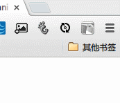

# 前端构建工具 
基于[Gulp](http://gulpjs.com/)的前端构建工具

## 启动
1. 下载项目
1. 安装 [Nodejs](http://nodejs.org/)
1. 安装 [Gulp](http://gulpjs.com/)
	* `npm install -g gulp`
1. 安装项目依赖
	* `cd 项目根目录`
	* `npm install`

## 目录结构
* `src` 源文件
	* `src/asserts` js,css等资源文件
	* `src/views` html文件
* `bulid` 构建后的文件

## 支持功能列表
* [脚本压缩](#js-min)
* [脚本代码质量(jshint)](#jshint)
* [CSS图片精灵](#css-sprite)
* [Liveload](#liveload) 页面的css，js，html发生改变时，主动的刷新页面

## 待支持的功能
* CSS,img的压缩
* 文件和合并
* 路径的替换：将文件中所有的开发路径和替换成发布路径
* Liveload 和静态服务器整合到一起

## <a name="js-min">脚本压缩</a>
执行 `gulp min-js`    
脚本压缩前，会执行脚本代码质量(jshint)。压缩后在文件头部加文件描述。

## <a name="js-min">脚本代码质量(jshint)</a>
本项目的验证规则见 `.jshint`文件。

## <a name="css-sprite">CSS图片精灵</a>
执行 `gulp sprite`    
生成图片精灵。

待做：将某个文件夹文件名称中以`icon-`开头的文件进行合并成一张图片精灵。

## <a name="liveload">Liveload</a>
使用此功能要安装Chrome插件,[点我安装](https://chrome.google.com/webstore/detail/livereload/jnihajbhpnppcggbcgedagnkighmdlei)。
执行    

1. `gulp watch`
1. 用静态服务器打开页面。推荐用使用[anywhere](https://www.npmjs.com/package/anywhere)
1. 在页面上启用Liveload的Chrome插件

